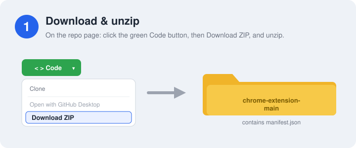
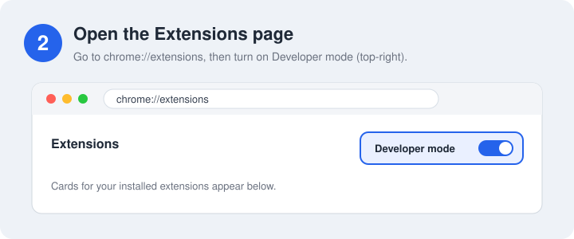
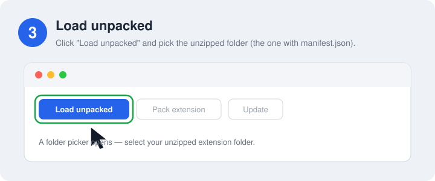
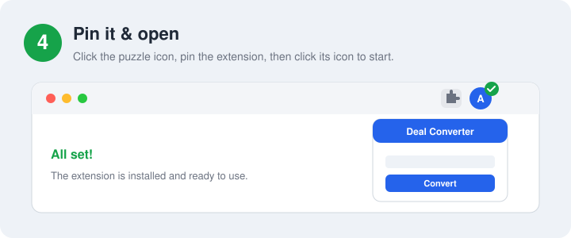
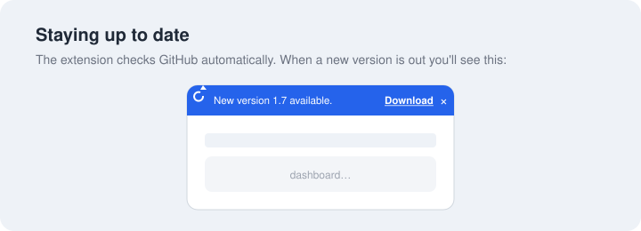

# Affiliaters Deal Converter

Turn any supported store link into your affiliate deal link — right from your browser. Convert on the page, from a popup, or in a full dashboard, and share in one click.

> **Chromium browsers only** — Google Chrome, Microsoft Edge, Brave, Opera. (No Firefox / Safari.)

---

## ✨ What it can do

### Convert deals anywhere
- **On-page Convert buttons** on **Amazon.in, Flipkart, Myntra, Croma, and Shopsy** — *Convert Only* (affiliate link, no post) and *Convert & Share* (convert + post to your channels).
- **Popup + full Dashboard** — paste any store link, convert instantly, preview the deal image, and copy the result.
- **Conversion history** — every link you convert is saved so you can find and re-copy it later.
- **Two platforms in one** — switch between **Affiliaters** and **EK Affiliaters** without reinstalling.

### Smart deal messages
- **Custom message templates** — write your own deal text under Settings → Message format (price, MRP, discount %, coupon, bank offers, final price, and more).
- **Reads the product page for you** — title, price, MRP, coupon line, and bank/card offers (Flipkart Best Value, Amazon card offers) so your posts stay accurate.
- **Math & conditions** — calculate pay-after-offer prices (`{{math …}}`) and show lines only when they matter (`{{if off >= 20}}`, per-store blocks, etc.).

### Share & automate
- **WhatsApp session link** — connect WhatsApp Web so *Convert & Share* can post deals for you.
- **WhatsApp automation** — on an open chat, auto-open store links in tabs, or forward messages straight to the converter (auto, manual ⚡ chip, or both).
- **Telegram automation** — same options on Telegram Web: open links, forward to converter, attach post images, choose which stores, background/foreground tabs.
- **Auto Post** — turn on per store so product pages can convert and post automatically (with a cooldown you control).
- **Product images** — optionally include the product image with shared posts.

### Stay up to date
- **Automatic updates** — run the one-time installer and the extension updates itself in the background (checks about every hour). No git required.
- **Update alerts** — if you skip the installer, a red `!` badge and an in-app banner still tell you when a new version is out.

### Control per store
- Toggle **Convert buttons**, **Auto Post**, and **product Image** per shopping site.
- Choose which buttons show on **product pages** vs **non-product / listing pages**.
- Light / dark theme in the dashboard.

---

## ⬇️ Install (about 1 minute)

### 1. Download & unzip
On this page, click the green **`< > Code`** button, then **Download ZIP**. Unzip it — you'll get a folder named **`chrome-extension-main`** that contains `manifest.json`.

### 2. Open the Extensions page
In your browser's address bar, go to **`chrome://extensions`** (Edge: `edge://extensions`) and turn on **Developer mode** (toggle at the top-right).

### 3. Load unpacked
Click **Load unpacked** and select the **unzipped folder** (the one with `manifest.json` inside).

### 4. Pin it & open
Click the puzzle-piece icon in the toolbar, **pin** *Affiliaters Deal Converter*, then click its icon to start.

### 5. Turn on auto-updates (recommended)
In the extension folder, double-click **`install/install.bat`** (Windows) or **`install/install.command`** (macOS — if blocked, right-click → Open). Done once, the extension keeps itself up to date automatically. Details in [Updating](#-updating) below.

That's it — the extension is installed and ready to use.

---

## 🔄 Updating

### Recommended: turn on automatic updates (one time, 10 seconds)

The extension folder includes its own updater — run the installer for your system **once**, from inside the extension folder (it works no matter where you keep the folder):

- **Windows:** double-click **`install/install.bat`**
- **macOS:** double-click **`install/install.command`** — if macOS blocks it, right-click it → **Open** → **Open**. (Or in Terminal: `bash install/install.command`)
- **Linux:** run `bash install/install.command`

That's it. From then on the extension **updates itself in the background** — it checks for new versions every hour and applies them without you doing anything, even if you never close your browser. No git or other tools required.

> If you ever **move the extension folder**, run the installer again from the new location (Chrome also requires re-loading a moved unpacked folder).
> The file `last-update.log` inside the folder shows what the updater last did.

### Manual update (fallback)

If you skip the installer, the extension still checks for new versions and shows a **red `!` badge** on the icon and a **“New version available — Download”** banner when you open it.

1. Click **Download** on the banner (or use **`< > Code` → Download ZIP** here) and unzip it.
2. Replace the **contents** of your old extension folder with the newly unzipped files.
3. On `chrome://extensions`, press **Reload** on the extension card.

---

## 🧰 Troubleshooting

| Problem | Fix |
|---|---|
| "Manifest file is missing or unreadable" | You selected the wrong folder — pick the one that **directly contains** `manifest.json`. |
| No Convert buttons on a store | Refresh the page after installing. Make sure the site is enabled in the extension. |
| Nothing happens on click | Open the extension, sign in / authorize your platform, then try again. |
| Update banner won't go away | Install the latest version, or click **×** to dismiss until the next release. |

---

## 🔒 Privacy, permissions & risk — read before you enable the helpers

> **This is the GitHub / sideloaded build, not the Chrome Web Store version.** It has capabilities the store build does not, and those capabilities carry real account risk. The store build is covered by different, narrower policies at [affiliaters.in/extension-privacy](https://affiliaters.in/extension-privacy) and [affiliaters.in/extension-terms](https://affiliaters.in/extension-terms).

The extension needs access to the supported store sites (Convert buttons + product details), WhatsApp Web / Telegram Web (session linking and automation), and the Affiliaters API (convert links, share, history). It only runs on those sites and your chosen platform.

Three optional features move sensitive account material and are **off until you switch them on**:

- **Amazon linking** — sends your `amazon.in` cookies, *including HttpOnly cookies*, to Affiliaters so short links are generated under your Associates account.
- **WhatsApp connect** — extracts WhatsApp Web **credentials and encryption keys**, uploads them to Affiliaters, then wipes the local WhatsApp Web session (you get logged out in that browser). Unofficial automation is against WhatsApp's ToS — Meta can restrict, lock or ban the number. **Don't use a number you can't afford to lose.**
- **Telegram / WhatsApp listeners** — while running, they also override the page's visibility state so the tab keeps receiving messages in the background.

Full details — what data is processed, why, and every permission — are in **[PRIVACY.md](PRIVACY.md)**. Your rights and obligations, including the risks above, are in **[TERMS.md](TERMS.md)**. We don't sell your data or include ads/analytics trackers.

---

## 💬 Help & feedback

Need help, found a bug, or have an idea? **Feature requests are welcome!**

- 📧 Email: **admin@affiliaters.in**
- 💬 Telegram: **[@AffiliatersHelpBot](https://t.me/AffiliatersHelpBot)**
